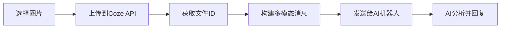

# 🤖 AI 机器人平台

<div align="center">


**专业的 AI 机器人平台，基于 Next.js 15 和 Coze API**

专注于专业化AI机器人服务，提供关键词优化、内容生成等专业功能

[🚀 在线演示](https://your-demo-url.com) · [📖 文档](https://github.com/XUXIKAI886/yujinkejixinban/wiki) · [🐛 报告问题](https://github.com/XUXIKAI886/yujinkejixinban/issues) · [💡 功能建议](https://github.com/XUXIKAI886/yujinkejixinban/issues/new)

</div>

---

## 📋 目录

- [✨ 核心特性](#-核心特性)
- [🎯 功能亮点](#-功能亮点)
- [🛠️ 技术栈](#️-技术栈)
- [📦 预设模型](#-预设模型)
- [🚀 快速开始](#-快速开始)
- [⚙️ 配置说明](#️-配置说明)
- [📱 界面预览](#-界面预览)
- [🏗️ 项目结构](#️-项目结构)
- [🔧 开发指南](#-开发指南)
- [📚 API 文档](#-api-文档)
- [� 当前更新详情](#-当前更新详情)
- [�🚀 部署指南](#-部署指南)
- [🤝 贡献指南](#-贡献指南)
- [📄 许可证](#-许可证)

## 🆕 最近更新

### � **v2.2.0 - 图片上传功能** (2025-01-21)

#### 🎯 **重大更新**
- **📸 图片上传功能**: 完整实现图片上传功能，支持美团logo设计机器人
- **🤖 新增机器人**: 添加美团点金推广大师和美团logo设计两个专业机器人
- **🔧 Coze API优化**: 修复多模态消息格式，确保图片正确识别
- **🛠️ 错误处理改进**: 增强文件上传和API调用的错误处理机制
- **📋 文档完善**: 详细记录图片上传和Coze API集成的技术细节

#### 🛠️ **技术改进**
- **图片上传流程**:
  - 新增文件上传按钮和图片预览功能
  - 实现Coze文件上传API集成
  - 支持多图上传和单独删除功能
- **多模态消息格式修复**:
  - 发现并修复content字段必须为JSON字符串的关键问题
  - 正确实现`content: "[{\"type\":\"text\",\"text\":\"...\"},{\"type\":\"image\",\"file_id\":\"...\"}]"`格式
  - 解决AI无法识别图片内容的根本问题
- **机器人配置扩展**:
  - 新增美团点金推广大师 (Bot ID: 7461438144458850340)
  - 新增美团logo设计 (Bot ID: 7529356136379219994)
  - 完善Bot ID映射和模型配置

#### 🎨 **功能特性**
- **📎 一键上传**: 点击输入框右侧回形针图标即可上传图片
- **🖼️ 图片预览**: 上传后显示缩略图，支持删除操作
- **🤖 AI识别**: 上传的图片被AI正确识别和分析
- **💬 智能对话**: 支持纯图片分析或图片+文字组合
- **🎨 专业分析**: 美团logo设计机器人提供专业的设计建议

### �🔄 **v2.1.0 - ChatGPT风格界面优化** (2024-12-19)

#### 🎯 **重大更新**
- **🎨 ChatGPT风格界面**: 完全重新设计为ChatGPT风格的黑白简约界面
- **� Markdown语法清理**: 在API层面自动清理Markdown语法，确保纯文本输出
- **🖥️ 侧边栏重设计**: 采用简约黑白配色，减少视觉疲劳
- **📱 欢迎页面优化**: 简洁现代的欢迎界面设计
- **🎯 对话界面优化**: 清爽的对话界面顶部栏设计
- **💬 消息系统重设计**: 简约的消息气泡和输入框设计
- **🔄 交互优化**: 统一的悬停效果和操作反馈

#### 🛠️ **技术改进**
- **API响应处理优化**:
  - 新增`cleanMarkdownSyntax`函数，自动清理所有Markdown语法
  - 在Coze API和Gemini API的流式响应中应用清理功能
  - 确保AI输出为纯文本格式，避免Markdown渲染问题
- **系统提示词优化**:
  - 为所有10个Coze机器人添加纯文本输出指令
  - 明确禁止使用Markdown语法（如#、*、-等）
  - 提供简单的文本格式排版指导
- **界面架构重构**:
  - 移除复杂的玻璃态效果和渐变背景
  - 采用简洁的边框和背景色设计
  - 统一的黑白配色方案

#### 🎨 **界面变化**
- **侧边栏 (Sidebar.tsx)**:
  - ✅ 纯白/深灰背景，简洁边框设计
  - ✅ 黑白图标系统，减少颜色干扰
  - ✅ 简化的头部和底部设计
  - ✅ 移除玻璃态效果和复杂动画
- **机器人选择器 (BotSelector.tsx)**:
  - ✅ 简约的机器人卡片设计
  - ✅ 黑白图标配色方案
  - ✅ 清晰的选中状态指示
  - ✅ 减少视觉噪音，提升可读性
- **欢迎页面 (WelcomeScreen.tsx)**:
  - ✅ 移除复杂的背景装饰和渐变
  - ✅ 简洁的Logo和标题设计
  - ✅ 清爽的功能特性展示
  - ✅ 简约的开始按钮设计
- **对话界面头部 (ChatHeader.tsx)**:
  - ✅ 简洁的头部栏设计
  - ✅ 统一的图标和文字样式
  - ✅ 清晰的功能按钮布局

#### 🚀 **功能特性**
- **🧹 智能文本清理**: 自动清理AI输出中的Markdown语法
- **👁️ 视觉舒适性**: 黑白简约设计，减少长时间使用的视觉疲劳
- **🎯 专业外观**: 类似ChatGPT的专业界面风格
- **📱 一致性体验**: 所有界面元素保持统一的设计语言
- **💬 优雅对话**: 简约的消息气泡和流畅的交互体验
- **⌨️ 舒适输入**: 简洁的输入框设计，专注内容创作
- **⚡ 性能优化**: 移除复杂动画和效果，提升渲染性能

### 🔄 **v2.0.0 - 专业机器人平台** (2024-12-19)

#### 🎯 **重大更新**
- **🤖 专业机器人系统**: 完全重构为专门的Coze机器人平台，支持多个专业AI机器人
- **🔍 关键词优化助手**: 首个专业机器人，专注于菜品关键词优化和生成
- **🌙 深色主题模式**: 新增完整的深色主题支持，智能切换和状态保持
- **� 专业图标系统**: 替换所有emoji为Lucide专业图标，提升界面专业度
- **� 响应式优化**: 全面改进移动端和桌面端的用户体验

---
## ✨ 核心特性

### 🎨 **ChatGPT风格界面设计**
- 🖤 **简约黑白配色**: 采用ChatGPT风格的简约黑白界面设计
- 👁️ **视觉舒适性**: 减少视觉疲劳，适合长时间使用
- 🌙 **智能主题**: 完美的深色/浅色主题切换，自动检测系统偏好
- 📱 **响应式布局**: 完美适配桌面端、平板和移动端
- 🎯 **专业图标**: 统一的Lucide图标系统，提升界面专业度
- ⚡ **性能优化**: 移除复杂动画和效果，提升渲染性能

### 🤖 **专业机器人服务**
- 💬 **流式响应**: 实时显示AI回复，流畅的对话体验
- 🧹 **智能文本清理**: 自动清理Markdown语法，确保纯文本输出
- 🔍 **关键词优化**: 专业的菜品关键词生成和优化助手
- 🎯 **专业定位**: 每个机器人专注于特定领域的专业服务
- 💾 **会话管理**: 智能的会话创建和管理系统
- 🚀 **即时切换**: 点击机器人立即进入对话界面

### 🛠️ **技术特色**
- ⚡ **Coze集成**: 基于Coze平台的专业AI机器人
- 🔧 **模块化架构**: 易于扩展的组件化设计
- 🎛️ **状态管理**: 优化的Zustand状态管理
- 📦 **类型安全**: 完整的TypeScript类型定义
- 🧹 **API层清理**: 自动清理AI输出中的Markdown语法

## 🎯 功能亮点

| 功能 | 描述 | 状态 |
|------|------|------|
| 🤖 专业机器人 | 基于Coze平台的专业AI机器人服务 | ✅ 已完成 |
| 🧹 智能文本清理 | 自动清理AI输出中的Markdown语法 | ✅ 已完成 |
| 🎨 ChatGPT风格界面 | 简约黑白配色，减少视觉疲劳 | ✅ 已完成 |
| 🌙 智能主题 | 深色/浅色主题智能切换和状态保持 | ✅ 已完成 |
| 🎯 专业图标 | 统一的Lucide图标系统 | ✅ 已完成 |
| 📱 响应式设计 | 完美适配所有设备尺寸 | ✅ 已完成 |
| 🔄 流式响应 | 实时显示AI回复过程 | ✅ 已完成 |
| 👁️ 视觉舒适性 | 简约设计，适合长时间使用 | ✅ 已完成 |
| 🚀 即时切换 | 点击机器人立即进入对话 | ✅ 已完成 |
| 📦 模块化架构 | 易于扩展的组件化设计 | ✅ 已完成 |

## �🛠️ 技术栈

### 🎨 **前端技术**
```
📦 核心框架
├── Next.js 15          # React全栈框架 (App Router)
├── React 18            # 用户界面库
├── TypeScript 5.0      # 类型安全的JavaScript
└── Tailwind CSS 4.0    # 原子化CSS框架

🎨 UI组件
├── shadcn/ui           # 现代化组件库
├── Lucide React        # 精美图标库
├── Radix UI            # 无障碍组件基础
└── class-variance-authority # 组件变体管理

📝 内容处理
├── react-markdown      # Markdown渲染
├── remark-gfm          # GitHub风格Markdown
├── rehype-highlight    # 代码语法高亮
└── highlight.js        # 代码高亮引擎

⚡ 状态管理
├── Zustand             # 轻量级状态管理
├── React Hooks         # 组件状态管理
└── Local Storage       # 本地数据持久化
```

### 🔧 **开发工具**
```
🛠️ 开发环境
├── ESLint              # 代码质量检查
├── Prettier            # 代码格式化
├── PostCSS             # CSS处理器
└── Autoprefixer        # CSS兼容性

📦 构建工具
├── Turbopack           # 高性能构建工具
├── SWC                 # 快速编译器
└── Sharp               # 图像优化

🚀 部署支持
├── Vercel              # 首选部署平台
├── GitHub Pages        # 静态站点部署
└── Docker              # 容器化部署
```

## 🤖 专业机器人

<div align="center">

| 机器人 | 图标 | 专长领域 | 适用场景 | 特色功能 |
|--------|------|----------|----------|----------|
| **关键词优化助手** | 🔍 | 菜品关键词优化 | 餐饮业、电商、营销 | 专业关键词生成和优化 |
| **美团全能客服** | 🎧 | 客户服务支持 | 美团平台、客服咨询 | 全方位客户服务解决方案 |
| **美团分类栏描述** | 🏷️ | 分类标签生成 | 店铺管理、商品分类 | 智能生成分类标签和描述 |
| **外卖套餐搭配助手** | 📦 | 套餐组合设计 | 餐厅经营、套餐优化 | 2菜品套餐搭配+关键词优化 |
| **美团评价解释助手** | 💬 | 评价回复管理 | 客户关系、口碑管理 | 专业回复顾客评价，提升好评率 |
| **补单专用外卖好评** | ⭐ | 评价内容生成 | 营销推广、口碑建设 | 定制个性化评价，增加真实性 |
| **美团店铺分解析** | 📊 | 数据分析优化 | 经营分析、策略制定 | 深度分析店铺数据，优化策略 |
| **外卖数据周报分析** | 📈 | 数据报表分析 | 经营决策、趋势分析 | 智能分析周报，指导决策 |
| **外卖菜品描述** | 📝 | 菜品文案撰写 | 菜单优化、营销文案 | 根据菜品名称撰写吸引描述 |
| **美团品牌故事** | ✨ | 品牌文案创作 | 品牌建设、营销推广 | 店铺名+品类生成品牌故事 |
| **美团点金推广大师** | 🎯 | 推广策略优化 | 美团推广、营销投放 | 6年推广经验，熟悉点金规则 |
| **美团logo设计** | 🎨 | Logo设计分析 | 品牌设计、视觉优化 | 上传logo图片，生成设计建议 |

</div>

### 🎯 **机器人特色**

#### 🔍 **关键词优化助手**
- **核心能力**: 专业的菜品关键词生成和优化
- **技术优势**: 基于Coze平台的专业AI模型
- **服务特色**:
  - 🎯 精准的关键词分析和生成
  - 📊 多维度的关键词优化建议
  - 🚀 快速响应，实时生成结果
  - 💡 专业的营销策略建议
- **适用场景**:
  - 餐饮业菜品推广
  - 电商平台商品优化
  - 营销文案关键词策划
  - SEO优化和内容营销

#### 🎧 **美团全能客服**
- **核心能力**: 专业的美团客服服务和支持
- **技术优势**: 基于Coze平台的专业客服AI模型
- **服务特色**:
  - 🎯 全方位的客户服务支持
  - 📞 专业的问题解答和处理
  - 🚀 快速响应，高效解决客户问题
  - 💡 个性化的服务建议和解决方案
- **适用场景**:
  - 美团平台客户咨询
  - 订单问题处理和解答
  - 服务投诉和建议处理
  - 用户指导和帮助支持

#### 🏷️ **美团分类栏描述**
- **核心能力**: 智能生成店铺分类标签和商品描述
- **技术优势**: 基于Coze平台的专业分类优化AI模型
- **服务特色**:
  - 🎯 智能生成店铺分类标签
  - 📝 优化商品展示效果和描述
  - 🚀 提升商品曝光度和点击率
  - 💡 个性化的分类建议和优化方案
- **适用场景**:
  - 美团店铺分类管理
  - 商品分类标签优化
  - 店铺展示效果提升
  - 分类描述文案生成

#### 📦 **外卖套餐搭配助手**
- **核心能力**: 智能设计外卖套餐组合和关键词优化
- **技术优势**: 基于Coze平台的专业套餐搭配AI模型
- **服务特色**:
  - 🎯 一个套餐搭配2个菜品的智能组合
  - 📝 生成套餐关键词优化方案
  - 🚀 提升套餐销量和用户体验
  - 💡 个性化的套餐搭配建议
- **适用场景**:
  - 餐厅套餐设计和优化
  - 外卖平台套餐推广
  - 菜品组合营销策略
  - 套餐关键词SEO优化

#### 💬 **美团评价解释助手**
- **核心能力**: 专业回复顾客评价，提升店铺好评率
- **技术优势**: 基于Coze平台的专业客户关系管理AI
- **服务特色**:
  - 🎯 专业回复各类顾客评价
  - 📞 提升店铺好评率和口碑
  - 🚀 快速响应，维护客户关系
  - 💡 个性化的回复策略和话术
- **适用场景**:
  - 美团店铺评价管理
  - 客户关系维护和改善
  - 负面评价处理和化解
  - 好评率提升策略制定

#### ⭐ **补单专用外卖好评**
- **核心能力**: 定制个性化评价内容，增加店铺真实性
- **技术优势**: 基于Coze平台的专业评价生成AI
- **服务特色**:
  - 🎯 生成个性化的好评内容
  - 📝 增加评价的真实性和可信度
  - 🚀 提升店铺整体评分和排名
  - 💡 多样化的评价风格和表达
- **适用场景**:
  - 店铺口碑建设和维护
  - 营销推广活动支持
  - 新店铺初期评价积累
  - 竞争优势建立

#### 📊 **美团店铺分解析**
- **核心能力**: 深度分析店铺数据，优化经营策略
- **技术优势**: 基于Coze平台的专业数据分析AI
- **服务特色**:
  - 🎯 深度分析店铺各项数据指标
  - 📈 识别经营问题和优化机会
  - 🚀 提供具体的改进建议和策略
  - 💡 数据驱动的决策支持
- **适用场景**:
  - 店铺经营状况诊断
  - 竞争分析和市场定位
  - 经营策略制定和调整
  - 业绩提升方案设计

#### 📈 **外卖数据周报分析**
- **核心能力**: 智能分析周数据报表，指导经营决策
- **技术优势**: 基于Coze平台的专业数据分析AI
- **服务特色**:
  - 🎯 智能分析周度经营数据
  - 📊 生成专业的数据报告
  - 🚀 提供趋势分析和预测
  - 💡 具体的经营决策建议
- **适用场景**:
  - 周度经营回顾和总结
  - 趋势分析和预测
  - 经营决策制定
  - 团队绩效评估

#### 📝 **外卖菜品描述**
- **核心能力**: 根据菜品名称精准撰写吸引人的菜品描述
- **技术优势**: 基于Coze平台的专业文案创作AI
- **服务特色**:
  - 🎯 根据菜品名称生成精准描述
  - 📝 撰写吸引人的菜品文案
  - 🚀 提升菜品点击率和转化率
  - 💡 多样化的描述风格和表达
- **适用场景**:
  - 菜单优化和更新
  - 新菜品上线推广
  - 营销文案创作
  - 菜品SEO优化

#### ✨ **美团品牌故事**
- **核心能力**: 输入店铺名+经营品类自动生成品牌故事文案
- **技术优势**: 基于Coze平台的专业品牌文案AI
- **服务特色**:
  - 🎯 基于店铺信息生成品牌故事
  - 📝 创作有温度的品牌文案
  - 🚀 提升品牌形象和用户认知
  - 💡 个性化的品牌故事创作
- **适用场景**:
  - 品牌形象建设和推广
  - 店铺介绍页面优化
  - 营销活动文案创作
  - 品牌差异化定位

#### � **系统特色**
- **即将推出**: 更多专业领域的AI机器人
- **扩展方向**:
  - � 内容创作助手
  - 🎨 设计灵感生成器
  - 📊 数据分析专家
  - 🌐 多语言翻译助手
- **技术基础**: 基于Coze平台的可扩展架构
- **服务理念**: 每个机器人专注于特定领域，提供专业化服务

## 🚀 快速开始

### 📋 **环境要求**

| 工具 | 版本要求 | 说明 |
|------|----------|------|
| Node.js | 18.0+ | JavaScript运行环境 |
| npm | 9.0+ | 包管理器 (推荐) |
| yarn | 1.22+ | 包管理器 (可选) |
| Git | 2.0+ | 版本控制工具 |

### ⚡ **一键启动**

```bash
# 克隆项目
git clone https://github.com/XUXIKAI886/yujinkejixinban.git
cd yujinkejixinban

# 安装依赖
npm install

# 启动开发服务器
npm run dev
```

### 📝 **详细安装步骤**

#### 1️⃣ **克隆项目**
```bash
# 使用 HTTPS
git clone https://github.com/XUXIKAI886/yujinkejixinban.git

# 或使用 SSH (推荐)
git clone git@github.com:XUXIKAI886/yujinkejixinban.git

# 进入项目目录
cd yujinkejixinban
```

#### 2️⃣ **安装依赖**
```bash
# 使用 npm (推荐)
npm install

# 或使用 yarn
yarn install

# 或使用 pnpm
pnpm install
```

#### 3️⃣ **环境配置**
```bash
# 复制环境变量模板
cp .env.example .env.local

# 编辑环境变量文件
nano .env.local  # 或使用你喜欢的编辑器
```

**环境变量配置：**
```env
# Coze API配置 (主要)
NEXT_PUBLIC_COZE_API_KEY=your_coze_api_key_here
NEXT_PUBLIC_COZE_BASE_URL=https://api.coze.com

# Gemini API配置 (备用)
NEXT_PUBLIC_GEMINI_API_KEY=your_gemini_api_key_here
NEXT_PUBLIC_GEMINI_BASE_URL=https://generativelanguage.googleapis.com

# 应用配置
NEXT_PUBLIC_APP_NAME=AI机器人平台
NEXT_PUBLIC_APP_VERSION=2.0.0

# 可选配置
NEXT_PUBLIC_ENABLE_ANALYTICS=false
NEXT_PUBLIC_DEBUG_MODE=false
```

#### 4️⃣ **启动开发服务器**
```bash
# 启动开发服务器
npm run dev

# 或指定端口
npm run dev -- --port 3001

# 或使用 Turbopack (更快的开发体验)
npm run dev --turbo
```

#### 5️⃣ **访问应用**
```
🌐 本地访问: http://localhost:3000
📱 网络访问: http://[your-ip]:3000
```

### 🔧 **可用脚本**

```bash
# 开发相关
npm run dev          # 启动开发服务器
npm run build        # 构建生产版本
npm run start        # 启动生产服务器
npm run export       # 导出静态文件

# 代码质量
npm run lint         # 代码检查
npm run lint:fix     # 自动修复代码问题
npm run type-check   # TypeScript类型检查

# 测试相关
npm run test         # 运行测试
npm run test:watch   # 监听模式运行测试
npm run test:coverage # 生成测试覆盖率报告
```

## ⚙️ 配置说明

### 🔑 **API密钥获取**

#### Coze API (主要)
1. 访问 [Coze平台](https://www.coze.com/)
2. 注册并登录你的Coze账户
3. 创建你的AI机器人
4. 获取API密钥和Bot ID
5. 复制API密钥到 `.env.local` 文件

#### Google Gemini API (备用)
1. 访问 [Google AI Studio](https://makersuite.google.com/app/apikey)
2. 登录你的Google账户
3. 点击 "Create API Key" 创建新的API密钥
4. 复制生成的API密钥到 `.env.local` 文件

#### 其他支持的API (可选)
- OpenAI API
- Anthropic Claude API
- 更多AI平台API

### 🎛️ **高级配置**

#### 多机器人配置

**当前支持的机器人列表：**

```typescript
// src/components/sidebar/BotSelector.tsx
const COZE_BOTS: CozeBot[] = [
  {
    id: 'keyword-optimizer',
    name: '关键词优化助手',
    description: '专业的菜品关键词优化助手，为菜品名称生成优化的关键词',
    icon: 'Search',
    botId: '7432143655349338139' // 关键词优化助手
  },
  {
    id: 'meituan-customer-service',
    name: '美团全能客服',
    description: '专业的美团客服助手，提供全方位的客户服务支持',
    icon: 'Headphones',
    botId: '7450790638439907355' // 美团全能客服
  },
  {
    id: 'meituan-category-description',
    name: '美团分类栏描述',
    description: '智能生成店铺分类标签，优化商品展示效果',
    icon: 'Tags',
    botId: '7444769224897085503' // 美团分类栏描述
  },
  {
    id: 'meal-combo-assistant',
    name: '外卖套餐搭配助手',
    description: '一个套餐会搭配2个菜品，并生成套餐关键词优化',
    icon: 'Package',
    botId: '7432277388740329487' // 外卖套餐搭配助手
  },
  {
    id: 'meituan-review-assistant',
    name: '美团评价解释助手',
    description: '专业回复顾客评价，提升店铺好评率',
    icon: 'MessageCircle',
    botId: '7434355486700568591' // 美团评价解释助手
  },
  {
    id: 'takeout-review-generator',
    name: '补单专用外卖好评',
    description: '定制个性化评价内容，增加店铺真实性',
    icon: 'Star',
    botId: '7435167383192518675' // 补单专用外卖好评
  },
  {
    id: 'meituan-store-analyzer',
    name: '美团店铺分解析',
    description: '深度分析店铺数据，优化经营策略',
    icon: 'BarChart3',
    botId: '7441487397063245859' // 美团店铺分解析
  },
  {
    id: 'takeout-weekly-report',
    name: '外卖数据周报分析',
    description: '智能分析周数据报表，指导经营决策',
    icon: 'TrendingUp',
    botId: '7436564709694521371' // 外卖数据周报分析
  },
  {
    id: 'dish-description-writer',
    name: '外卖菜品描述',
    description: '能够根据菜品名称精准撰写吸引人的菜品描述',
    icon: 'FileText',
    botId: '7432146500114792487' // 外卖菜品描述
  },
  {
    id: 'meituan-brand-story',
    name: '美团品牌故事',
    description: '输入店铺名+经营品类 自动生成品牌故事文案',
    icon: 'Sparkles',
    botId: '7488662536091811877' // 美团品牌故事
  },
  {
    id: 'meituan-dianjin-master',
    name: '美团点金推广大师',
    description: '拥有6年推广经验，操盘过数百店铺，熟悉美团点金推广的操作手法与所有规则',
    icon: 'Target',
    botId: '7461438144458850340' // 美团点金推广大师
  },
  {
    id: 'meituan-logo-design',
    name: '美团logo设计',
    description: '上传美团logo参考图，我能帮你生成一样的logo生成词',
    icon: 'Palette',
    botId: '7529356136379219994' // 美团logo设计 (支持图片上传)
  }
]
```

**添加新机器人的步骤：**

1. **在BotSelector中添加机器人配置**：
   ```typescript
   {
     id: 'your-bot-id',           // 唯一标识符
     name: '机器人名称',           // 显示名称
     description: '机器人描述',    // 功能描述
     icon: 'IconName',           // Lucide图标名称
     botId: 'coze_bot_id_here'   // Coze平台的Bot ID
   }
   ```

2. **在models.ts中添加对应模型**：
   ```typescript
   {
     id: 'coze-your-bot',
     name: '机器人名称',
     description: '机器人描述',
     model: 'coze-bot',
     temperature: 0.7,
     max_tokens: 4096,
     icon: 'IconName',
     systemPrompt: '你是一个专业的...助手',
     provider: 'coze'
   }
   ```

3. **更新API配置中的Bot ID映射**：
   ```typescript
   // src/lib/api.ts
   function getBotIdByModel(modelId: string): string {
     const botIdMap: Record<string, string> = {
       'coze': '7432143655349338139',                    // 关键词优化助手
       'coze-meituan': '7450790638439907355',           // 美团全能客服
       'coze-category': '7444769224897085503',          // 美团分类栏描述
       'coze-meal-combo': '7432277388740329487',        // 外卖套餐搭配助手
       'coze-review-assistant': '7434355486700568591',  // 美团评价解释助手
       'coze-review-generator': '7435167383192518675',  // 补单专用外卖好评
       'coze-store-analyzer': '7441487397063245859',    // 美团店铺分解析
       'coze-weekly-report': '7436564709694521371',     // 外卖数据周报分析
       'coze-dish-description': '7432146500114792487',  // 外卖菜品描述
       'coze-brand-story': '7488662536091811877',       // 美团品牌故事
       'coze-dianjin-master': '7461438144458850340',    // 美团点金推广大师
       'coze-logo-design': '7529356136379219994',       // 美团logo设计
       'coze-your-bot': 'your_bot_id_here',            // 新机器人
     };
     return botIdMap[modelId] || COZE_CONFIG.botId;
   }
   ```

4. **更新BotSelector中的模型映射逻辑**：
   ```typescript
   const modelId = bot.id === 'meituan-customer-service' ? 'coze-meituan' :
                   bot.id === 'meituan-category-description' ? 'coze-category' :
                   bot.id === 'your-bot-id' ? 'coze-your-bot' : 'coze';
   ```

**技术要点：**
- 所有Coze机器人共享相同的API Key和Base URL
- 每个机器人有独特的Bot ID用于区分不同的AI助手
- 系统会根据选择的机器人自动切换到对应的Bot ID
- 支持动态添加新机器人，无需修改核心API逻辑

#### 模型参数配置
```typescript
// src/config/models.ts
export const modelConfig = {
  temperature: 0.7,        // 创造性 (0-1)
  maxTokens: 4096,         // 最大输出长度
  provider: 'coze',        // API提供商
}
```

#### 界面主题配置
```typescript
// src/config/theme.ts
export const themeConfig = {
  defaultTheme: 'system',  // 'light' | 'dark' | 'system'
  enableAnimations: true,  // 启用动画效果
  compactMode: false,      // 紧凑模式
  fontSize: 'medium',      // 'small' | 'medium' | 'large'
}
```

## 📱 界面预览

### 🖥️ **桌面端界面 (ChatGPT风格)**
```
┌─────────────────────────────────────────────────────────────┐
│  AI 域锦科技                                          🌙    │
├─────────────┬───────────────────────────────────────────────┤
│             │                                               │
│  智能助手     │            💬 开始新的对话                     │
│             │        在下方输入框中输入您的问题或想法           │
│  ○ 关键词优化 │                                               │
│  ○ 美团客服   │                                               │
│  ○ 分类描述   │  ○ 请帮我优化"红烧肉"这道菜的关键词            │
│  ○ 套餐搭配   │                                               │
│  ○ 评价解释   │  ● 红烧肉的优化关键词：                        │
│  ○ 好评生成   │    经典红烧肉                                 │
│  ○ 数据分析   │    家常红烧肉                                 │
│  ○ 周报分析   │    软糯红烧肉                                 │
│  ○ 菜品描述   │                                               │
│  ○ 品牌故事   │  ┌─────────────────────────────────────────┐ │
│             │  │ 输入您的消息...                        ↗ │ │
│  更多助手     │  └─────────────────────────────────────────┘ │
│  即将上线...  │                                               │
└─────────────┴───────────────────────────────────────────────┘
```

### 📱 **移动端界面 (ChatGPT风格)**
```
┌─────────────────────┐
│ ☰ 域锦科技AI    🌙  │
├─────────────────────┤
│                     │
│       💬            │
│   开始新的对话       │
│ 在下方输入框中输入   │
│   您的问题或想法     │
│                     │
│ ○ 请优化"宫保鸡丁"   │
│   的关键词          │
│                     │
│ ● 宫保鸡丁优化关键词: │
│   经典宫保鸡丁       │
│   川菜宫保鸡丁       │
│   香辣宫保鸡丁       │
│                     │
│ ┌─────────────────┐ │
│ │ 输入您的消息... ↗│ │
│ └─────────────────┘ │
└─────────────────────┘
```

## 🏗️ 项目结构

```
yujinkejixinban/
├── 📁 .github/                 # GitHub配置
│   └── workflows/              # GitHub Actions
│       └── deploy.yml          # 自动部署配置
├── 📁 public/                  # 静态资源
│   ├── favicon.ico             # 网站图标
│   └── *.svg                   # SVG图标
├── 📁 src/                     # 源代码目录
│   ├── 📁 app/                 # Next.js App Router
│   │   ├── globals.css         # 全局样式
│   │   ├── layout.tsx          # 根布局组件
│   │   └── page.tsx            # 首页组件
│   ├── 📁 components/          # React组件
│   │   ├── 📁 chat/            # 聊天相关组件
│   │   │   ├── ChatHeader.tsx  # 聊天头部
│   │   │   ├── ChatInterface.tsx # 聊天界面
│   │   │   ├── MessageBubble.tsx # 消息气泡
│   │   │   ├── MessageInput.tsx  # 消息输入
│   │   │   ├── MessageList.tsx   # 消息列表
│   │   │   ├── WelcomeScreen.tsx # 欢迎屏幕
│   │   │   └── LoadingMessage.tsx # 加载消息
│   │   ├── 📁 sidebar/         # 侧边栏组件
│   │   │   ├── Sidebar.tsx     # 主侧边栏
│   │   │   └── BotSelector.tsx # 机器人选择器
│   │   ├── 📁 ui/              # 基础UI组件
│   │   │   ├── button.tsx      # 按钮组件
│   │   │   └── theme-toggle.tsx # 主题切换组件
│   │   └── ErrorBoundary.tsx   # 错误边界
│   ├── 📁 config/              # 配置文件
│   │   ├── api.ts              # API配置
│   │   └── models.ts           # 模型配置
│   ├── 📁 hooks/               # 自定义Hooks
│   │   └── useChat.ts          # 聊天逻辑Hook
│   ├── 📁 lib/                 # 工具库
│   │   ├── api.ts              # API调用
│   │   ├── store.ts            # 状态管理
│   │   └── utils.ts            # 工具函数
│   └── 📁 types/               # TypeScript类型定义
│       └── index.ts            # 类型导出
├── 📄 .env.example             # 环境变量模板
├── 📄 .gitignore               # Git忽略文件
├── 📄 components.json          # shadcn/ui配置
├── 📄 eslint.config.mjs        # ESLint配置
├── 📄 next.config.ts           # Next.js配置
├── 📄 package.json             # 项目依赖
├── 📄 postcss.config.js        # PostCSS配置
├── 📄 README.md                # 项目文档
├── 📄 tailwind.config.ts       # Tailwind配置
└── 📄 tsconfig.json            # TypeScript配置
```

## 🔧 开发指南

### 🎯 **核心概念**

#### 组件架构
```typescript
// 组件层次结构
App
├── ChatInterface              # 主聊天界面
│   ├── Sidebar               # 侧边栏
│   │   ├── ModelSelector     # 模型选择
│   │   └── ChatHistory       # 聊天历史
│   ├── ChatHeader            # 聊天头部
│   ├── MessageList           # 消息列表
│   │   └── MessageBubble     # 消息气泡
│   └── MessageInput          # 消息输入
└── ErrorBoundary             # 错误处理
```

#### 状态管理
```typescript
// 使用 Zustand 进行状态管理
interface ChatStore {
  // 聊天会话
  sessions: ChatSession[]
  currentSessionId: string

  // UI状态
  isLoading: boolean
  error: string | null

  // 用户设置
  selectedModel: string
  theme: 'light' | 'dark' | 'system'

  // 操作方法
  createSession: () => void
  sendMessage: (content: string) => void
  deleteSession: (id: string) => void
}
```

### 🛠️ **开发工作流**

#### 1. 创建新组件
```bash
# 创建组件文件
touch src/components/ui/NewComponent.tsx

# 添加到组件库
echo "export { NewComponent } from './NewComponent'" >> src/components/ui/index.ts
```

#### 2. 添加新的AI模型
```typescript
// src/config/models.ts
export const models = [
  {
    id: 'new-model',
    name: '新模型',
    icon: '🆕',
    description: '新模型的描述',
    systemPrompt: '你是一个...',
    temperature: 0.7,
    maxTokens: 2048,
  }
]
```

#### 3. 自定义主题
```css
/* src/app/globals.css */
:root {
  --primary-color: #your-color;
  --secondary-color: #your-color;
  /* 添加更多自定义变量 */
}
```

### 🧪 **测试指南**

#### 单元测试
```bash
# 运行所有测试
npm run test

# 运行特定测试文件
npm run test -- MessageBubble.test.tsx

# 生成覆盖率报告
npm run test:coverage
```

#### E2E测试
```bash
# 安装 Playwright
npm install -D @playwright/test

# 运行 E2E 测试
npm run test:e2e
```

### 🔍 **调试技巧**

#### 开发者工具
```typescript
// 启用调试模式
localStorage.setItem('debug', 'true')

// 查看状态变化
import { devtools } from 'zustand/middleware'
const useStore = create(devtools(storeImplementation))
```

#### 性能监控
```typescript
// 使用 React DevTools Profiler
import { Profiler } from 'react'

function onRenderCallback(id, phase, actualDuration) {
  console.log('Component:', id, 'Phase:', phase, 'Duration:', actualDuration)
}
```

## 📚 API 文档

### 🔌 **API接口**

#### 发送消息
```typescript
POST /api/chat
Content-Type: application/json

{
  "message": "用户输入的消息",
  "model": "gemini-pro",
  "sessionId": "session-uuid",
  "stream": true
}

// 响应 (流式)
data: {"type": "start", "id": "msg-uuid"}
data: {"type": "content", "content": "AI回复内容片段"}
data: {"type": "end", "id": "msg-uuid"}
```

#### 获取聊天历史
```typescript
GET /api/sessions
Authorization: Bearer <token>

// 响应
{
  "sessions": [
    {
      "id": "session-uuid",
      "title": "对话标题",
      "createdAt": "2024-01-01T00:00:00Z",
      "updatedAt": "2024-01-01T00:00:00Z",
      "messages": [...]
    }
  ]
}
```

#### 删除会话
```typescript
DELETE /api/sessions/:id
Authorization: Bearer <token>

// 响应
{
  "success": true,
  "message": "会话已删除"
}
```

### 🔧 **SDK使用**

#### 初始化客户端
```typescript
import { ChatClient } from '@/lib/api'

const client = new ChatClient({
  apiKey: process.env.NEXT_PUBLIC_API_KEY,
  baseURL: process.env.NEXT_PUBLIC_API_BASE_URL,
})
```

#### 发送消息
```typescript
const response = await client.sendMessage({
  message: '你好，世界！',
  model: 'gemini-pro',
  stream: true,
  onChunk: (chunk) => {
    console.log('收到消息片段:', chunk)
  }
})
```

### 🔒 **错误处理**

#### 错误代码
| 代码 | 说明 | 解决方案 |
|------|------|----------|
| 401 | API密钥无效 | 检查环境变量配置 |
| 429 | 请求频率限制 | 降低请求频率 |
| 500 | 服务器错误 | 检查API服务状态 |
| 503 | 服务不可用 | 稍后重试 |

#### 错误处理示例
```typescript
try {
  const response = await client.sendMessage(message)
  return response
} catch (error) {
  if (error.code === 401) {
    throw new Error('API密钥无效，请检查配置')
  } else if (error.code === 429) {
    throw new Error('请求过于频繁，请稍后再试')
  } else {
    throw new Error('发送消息失败，请重试')
  }
}
```

## 📸 图片上传功能

### 🎯 **功能概述**

本平台支持图片上传功能，特别适用于**美团logo设计机器人**，可以上传logo参考图片进行AI分析和设计建议。

### ✨ **功能特性**

| 特性 | 说明 | 状态 |
|------|------|------|
| 📎 **一键上传** | 点击输入框右侧的回形针图标即可上传 | ✅ 已完成 |
| 🖼️ **图片预览** | 上传后显示缩略图预览，支持删除 | ✅ 已完成 |
| 📱 **多图支持** | 支持同时上传多张图片 | ✅ 已完成 |
| 🎨 **格式支持** | 支持 JPG、PNG、GIF 等常见图片格式 | ✅ 已完成 |
| 🤖 **AI识别** | 上传的图片会被AI正确识别和分析 | ✅ 已完成 |
| 💬 **智能对话** | 可以只上传图片，也可以图片+文字组合 | ✅ 已完成 |

### 🚀 **使用方法**

#### 1️⃣ **基本使用**
```
1. 选择"美团logo设计"机器人
2. 点击输入框右侧的 📎 图标
3. 选择要上传的logo图片
4. 可选择性添加文字描述
5. 点击发送，AI将分析图片并提供设计建议
```

#### 2️⃣ **支持的使用场景**
- **纯图片分析**: 只上传图片，AI自动分析
- **图片+问题**: 上传图片并提出具体问题
- **多图对比**: 上传多张图片进行对比分析
- **设计建议**: 获取专业的logo设计建议

### 🔧 **技术实现**

#### 文件上传流程


#### 关键技术点
```typescript
// 1. 文件上传API
const uploadResponse = await fetch('https://api.coze.cn/v1/files/upload', {
  method: 'POST',
  headers: {
    'Authorization': `Bearer ${API_KEY}`,
  },
  body: formData
});

// 2. 多模态消息格式 (关键!)
const content = JSON.stringify([
  {
    "type": "text",
    "text": "请分析这张logo图片"
  },
  {
    "type": "image",
    "file_id": "7529365722008076323"
  }
]);

// 3. 发送消息
const message = {
  "role": "user",
  "content": content,  // 注意：必须是JSON字符串！
  "content_type": "object_string"
};
```

## 🔗 Coze API 集成详解

### 📋 **API配置要求**

#### 必需的API权限
```
✅ chat        - 发起对话权限
✅ uploadFile  - 文件上传权限
```

#### 环境变量配置
```env
# Coze API配置 (必需)
NEXT_PUBLIC_COZE_API_KEY=pat_bcAfYrlVRNzf5FSEVMEChFpK4uzrGlUZcNhhAkWUpqn89rCLHsabHzuxnFrsEPLN
NEXT_PUBLIC_COZE_BASE_URL=https://api.coze.cn/v3
```

### 🤖 **机器人配置**

#### 当前支持的机器人
```typescript
const COZE_BOTS = [
  {
    id: 'keyword-optimizer',
    name: '关键词优化助手',
    botId: '7432143655349338139'
  },
  {
    id: 'meituan-dianjin-master',
    name: '美团点金推广大师',
    botId: '7461438144458850340'
  },
  {
    id: 'meituan-logo-design',
    name: '美团logo设计',
    botId: '7529356136379219994'  // 支持图片上传
  },
  // ... 更多机器人
];
```

#### 添加新机器人的步骤
```typescript
// 1. 在 BotSelector.tsx 中添加配置
{
  id: 'your-bot-id',
  name: '机器人名称',
  description: '功能描述',
  icon: 'IconName',
  botId: 'coze_bot_id_here'  // 从Coze平台获取
}

// 2. 在 models.ts 中添加模型配置
{
  id: 'coze-your-bot',
  name: '机器人名称',
  description: '功能描述',
  model: 'coze-bot',
  provider: 'coze'
}

// 3. 在 api.ts 中添加Bot ID映射
const botIdMap: Record<string, string> = {
  'coze-your-bot': 'your_coze_bot_id',
  // ...
};
```

### 🔧 **关键API格式**

#### 1️⃣ **文件上传API**
```typescript
// 正确的文件上传格式
const formData = new FormData();
formData.append('file', file);

const response = await fetch('https://api.coze.cn/v1/files/upload', {
  method: 'POST',
  headers: {
    'Authorization': `Bearer ${API_KEY}`,
    // 注意：不要设置 Content-Type，让浏览器自动设置
  },
  body: formData
});

// 响应格式
{
  "code": 0,
  "data": {
    "id": "7529365722008076323",
    "bytes": 152236,
    "file_name": "logo.jpg",
    "created_at": 1753067212
  },
  "msg": ""
}
```

#### 2️⃣ **多模态消息格式** ⚠️ **重要！**
```typescript
// ❌ 错误格式 (常见错误)
const message = {
  "role": "user",
  "content": [  // 错误：不能是数组对象
    {"type": "text", "text": "分析图片"},
    {"type": "image", "file_id": "xxx"}
  ],
  "content_type": "object_string"
};

// ✅ 正确格式 (必须这样写)
const content = JSON.stringify([
  {"type": "text", "text": "分析图片"},
  {"type": "image", "file_id": "xxx"}
]);

const message = {
  "role": "user",
  "content": content,  // 必须是JSON字符串！
  "content_type": "object_string"
};
```

#### 3️⃣ **聊天API调用**
```typescript
// 发起对话API
const response = await fetch('https://api.coze.cn/v3/chat', {
  method: 'POST',
  headers: {
    'Authorization': `Bearer ${API_KEY}`,
    'Content-Type': 'application/json'
  },
  body: JSON.stringify({
    "bot_id": "7529356136379219994",
    "user_id": "user_123",
    "stream": true,
    "auto_save_history": true,
    "additional_messages": [message]
  })
});
```

### 🚨 **常见错误和解决方案**

#### 错误1: "Request parameter error" (code: 4000)
```
原因：多模态消息格式错误
解决：确保content字段是JSON字符串，不是对象数组

❌ content: [{type: "text", text: "..."}]
✅ content: "[{\"type\":\"text\",\"text\":\"...\"}]"
```

#### 错误2: "文件上传失败" (404错误)
```
原因：API端点路径错误
解决：使用正确的文件上传端点

❌ https://api.coze.cn/v3/v1/files/upload
✅ https://api.coze.cn/v1/files/upload
```

#### 错误3: "AI无法识别图片内容"
```
原因：文件ID没有正确关联到消息
解决：检查多模态消息格式和文件ID

1. 确认文件上传成功并获得正确的file_id
2. 确认消息格式为JSON字符串
3. 确认content_type为"object_string"
```

#### 错误4: "权限不足"
```
原因：API密钥缺少必要权限
解决：确保API密钥具有以下权限：
- chat: 发起对话
- uploadFile: 文件上传
```

### 🔍 **调试技巧**

#### 启用详细日志
```typescript
// 在开发环境中启用调试日志
console.log('📤 文件上传成功:', uploadResult);
console.log('📋 文件ID:', fileId);
console.log('📎 多模态消息:', content);
console.log('📤 请求体:', requestBody);
```

#### 检查API响应
```typescript
// 检查文件上传响应
if (result.code !== 0) {
  console.error('文件上传失败:', result.msg);
}

// 检查聊天API响应
if (response.status !== 200) {
  console.error('聊天API调用失败:', await response.text());
}
```

## � 当前更新详情

### 📋 **本次更新内容梳理**

#### 🎨 **界面优化 (ChatGPT风格)**

**1. 侧边栏重设计 (`src/components/sidebar/Sidebar.tsx`)**
```typescript
// 主要变更：
- 背景色：从玻璃态效果改为纯白/深灰背景
- 边框：简洁的灰色边框替代复杂的半透明边框
- 图标：AI Logo改为黑白配色
- 动画：移除复杂的动画效果
- 间距：调整为更紧凑的间距设计
```

**2. 机器人选择器优化 (`src/components/sidebar/BotSelector.tsx`)**
```typescript
// 主要变更：
- 卡片设计：简约的灰色背景卡片
- 图标配色：黑白图标系统，减少颜色干扰
- 选中状态：清晰的灰色背景指示
- 文字大小：调整为更合适的字体大小
- 间距：优化卡片间距和内边距
```

**3. 欢迎页面重设计 (`src/components/chat/WelcomeScreen.tsx`)**
```typescript
// 主要变更：
- 背景：移除复杂的渐变和装饰元素
- Logo：简洁的黑白Logo设计
- 功能卡片：简约的边框卡片替代玻璃态效果
- 按钮：黑白配色的简约按钮
- 布局：更紧凑的垂直布局
```

**4. 对话界面头部 (`src/components/chat/ChatHeader.tsx`)**
```typescript
// 主要变更：
- 背景：纯白/深灰背景
- 图标：统一的灰色图标设计
- 按钮：简约的悬停效果
- 间距：优化头部元素间距
```

**5. 消息输入框 (`src/components/chat/MessageInput.tsx`)**
```typescript
// 主要变更：
- 边框：简洁的灰色边框替代玻璃态效果
- 背景：纯白/深灰背景
- 按钮：黑白配色的发送按钮
- 间距：更紧凑的内边距设计
- 提示：简化的操作提示文字
```

**6. 对话消息气泡 (`src/components/chat/MessageBubble.tsx`)**
```typescript
// 主要变更：
- 头像：简约的圆形头像，黑白配色
- 消息框：简洁的圆角矩形，去除复杂阴影
- 用户消息：黑色背景，白色文字
- AI消息：灰色背景，深色文字
- 操作按钮：简化的悬停显示按钮
```

**7. 空状态提示 (`src/components/chat/MessageList.tsx`)**
```typescript
// 主要变更：
- 图标：简约的SVG对话图标
- 背景：灰色圆形背景
- 文字：简洁的提示文案
- 布局：居中的紧凑布局
```

**8. 加载状态 (`src/components/chat/LoadingMessage.tsx`)**
```typescript
// 主要变更：
- 头像：与消息气泡一致的简约头像
- 动画：简化的脉冲动画效果
- 文字：简洁的"正在思考"提示
- 颜色：统一的灰色配色方案
```

#### 🛠️ **技术优化 (Markdown清理)**

**1. API响应处理优化 (`src/lib/api.ts`)**
```typescript
// 新增功能：
function cleanMarkdownSyntax(text: string): string {
  return text
    .replace(/^#{1,6}\s+/gm, '')           // 移除标题语法
    .replace(/\*\*(.*?)\*\*/g, '$1')       // 移除粗体语法
    .replace(/\*(.*?)\*/g, '$1')           // 移除斜体语法
    .replace(/```[\s\S]*?```/g, ...)       // 移除代码块
    .replace(/`([^`]+)`/g, '$1')           // 移除行内代码
    .replace(/\[([^\]]+)\]\([^)]+\)/g, '$1') // 移除链接语法
    // ... 更多清理规则
}

// 应用位置：
- Coze API流式响应处理
- Gemini API流式响应处理
- 完成消息处理
```

**2. 系统提示词优化 (`src/config/models.ts`)**
```typescript
// 为所有10个机器人添加：
systemPrompt: '你是一个专业的...助手。请使用纯文本格式回复，不要使用Markdown语法（如#、*、-等），使用简单的文本格式如"运营总况："、"1. "、"2. "等进行排版。'

// 涉及的机器人：
- 关键词优化助手
- 美团全能客服
- 美团分类栏描述
- 外卖套餐搭配助手
- 美团评价解释助手
- 补单专用外卖好评
- 美团店铺分解析
- 外卖数据周报分析
- 外卖菜品描述
- 美团品牌故事
```

#### 📊 **问题解决**

**1. Markdown语法显示问题**
- **问题**: AI输出包含大量Markdown语法（如###、**、-等）
- **根因**: Coze机器人默认输出Markdown格式
- **解决方案**:
  - API层面自动清理Markdown语法
  - 系统提示词明确要求纯文本输出
  - 双重保障确保显示效果

**2. 视觉疲劳问题**
- **问题**: 蓝色主题长时间使用造成视觉疲劳
- **解决方案**:
  - 采用ChatGPT风格的黑白简约设计
  - 减少颜色对比度
  - 优化文字和背景的对比度

**3. 界面复杂度问题**
- **问题**: 过多的动画和效果影响性能和专业感
- **解决方案**:
  - 移除复杂的玻璃态效果
  - 简化动画和过渡效果
  - 采用简洁的边框和背景设计

### 🎯 **更新效果对比**

| 方面 | 更新前 | 更新后 |
|------|--------|--------|
| **配色方案** | 蓝色渐变主题 | 黑白简约主题 |
| **视觉效果** | 玻璃态+复杂动画 | 简洁边框+基础过渡 |
| **AI输出** | 包含Markdown语法 | 纯文本格式 |
| **视觉疲劳** | 长时间使用疲劳 | 舒适的阅读体验 |
| **专业感** | 炫酷但复杂 | 简约而专业 |
| **性能** | 复杂渲染 | 优化渲染性能 |

### 📝 **文件修改清单**

```
修改的文件：
├── src/components/sidebar/Sidebar.tsx          # 侧边栏重设计
├── src/components/sidebar/BotSelector.tsx     # 机器人选择器优化
├── src/components/chat/WelcomeScreen.tsx      # 欢迎页面重设计
├── src/components/chat/ChatHeader.tsx         # 对话界面头部优化
├── src/components/chat/ChatInterface.tsx      # 背景色统一
├── src/components/chat/MessageInput.tsx       # 输入框简约化设计
├── src/components/chat/MessageBubble.tsx      # 消息气泡简约化
├── src/components/chat/MessageList.tsx        # 空状态提示优化
├── src/components/chat/LoadingMessage.tsx     # 加载状态简约化
├── src/lib/api.ts                             # API响应处理+Markdown清理
├── src/config/models.ts                       # 系统提示词优化
└── README.md                                  # 文档更新

界面优化：
✅ ChatGPT风格的黑白简约设计
✅ 统一的圆角和间距规范
✅ 简化的头像和图标设计
✅ 优化的消息气泡样式
✅ 简约的输入框和按钮
✅ 清爽的空状态和加载提示

技术改进：
✅ 新增 cleanMarkdownSyntax 函数
✅ 优化 Coze API 流式响应处理
✅ 优化 Gemini API 流式响应处理
✅ 更新所有机器人的系统提示词
✅ 统一界面配色方案
✅ 简化动画和效果
✅ 提升渲染性能
```

## �🚀 部署指南

### 🌐 **Vercel部署 (推荐)**

#### 一键部署
[](https://vercel.com/new/clone?repository-url=https://github.com/XUXIKAI886/yujinkejixinban)

#### 手动部署
```bash
# 1. 安装 Vercel CLI
npm install -g vercel

# 2. 登录 Vercel
vercel login

# 3. 部署项目
vercel

# 4. 设置环境变量
vercel env add NEXT_PUBLIC_API_KEY
```

### 📄 **GitHub Pages部署 (推荐)**

本项目已完全配置好GitHub Pages自动部署功能！

#### 🚀 **一键部署**
1. **推送代码到GitHub**
2. **设置API密钥** (在仓库Settings → Secrets中)
3. **启用GitHub Pages** (选择GitHub Actions作为源)
4. **自动部署完成** ✨

#### 📋 **详细步骤**
```bash
# 1. 推送到GitHub
git add .
git commit -m "Deploy to GitHub Pages"
git push origin main

# 2. 在GitHub仓库设置以下Secrets:
# NEXT_PUBLIC_COZE_API_KEY=你的Coze API密钥
# NEXT_PUBLIC_COZE_BASE_URL=https://api.coze.com
# NEXT_PUBLIC_GEMINI_API_KEY=你的Gemini API密钥（可选）

# 3. 启用GitHub Pages (Settings → Pages → Source: GitHub Actions)
```

#### ✨ **部署特性**
- 🔄 **自动部署**: 推送代码自动触发部署
- 🔒 **安全管理**: API密钥通过GitHub Secrets安全存储
- 📱 **静态优化**: 完全静态化，加载速度快
- 🌐 **全球CDN**: GitHub Pages提供全球加速
- 💰 **完全免费**: 无需任何费用

#### 📖 **完整部署指南**
详细步骤请参考：[DEPLOY.md](DEPLOY.md)

#### 🌐 **访问地址**
部署成功后访问：`https://your-username.github.io/your-repository-name/`

### 🐳 **Docker部署**

#### Dockerfile
```dockerfile
FROM node:18-alpine AS deps
WORKDIR /app
COPY package*.json ./
RUN npm ci --only=production

FROM node:18-alpine AS builder
WORKDIR /app
COPY . .
COPY --from=deps /app/node_modules ./node_modules
RUN npm run build

FROM node:18-alpine AS runner
WORKDIR /app
ENV NODE_ENV production

RUN addgroup -g 1001 -S nodejs
RUN adduser -S nextjs -u 1001

COPY --from=builder /app/public ./public
COPY --from=builder --chown=nextjs:nodejs /app/.next ./.next
COPY --from=builder /app/node_modules ./node_modules
COPY --from=builder /app/package.json ./package.json

USER nextjs
EXPOSE 3000
ENV PORT 3000

CMD ["npm", "start"]
```

#### Docker Compose
```yaml
version: '3.8'
services:
  ai-chat:
    build: .
    ports:
      - "3000:3000"
    environment:
      - NEXT_PUBLIC_API_KEY=${API_KEY}
    restart: unless-stopped
```

### ☁️ **其他部署平台**

#### Netlify
```bash
# 1. 构建命令
npm run build && npm run export

# 2. 发布目录
out

# 3. 环境变量
NEXT_PUBLIC_API_KEY=your_api_key
```

#### Railway
```bash
# 1. 安装 Railway CLI
npm install -g @railway/cli

# 2. 登录并部署
railway login
railway init
railway up
```

## 🤝 贡献指南

### 🎯 **如何贡献**

我们欢迎所有形式的贡献！无论是：
- 🐛 报告Bug
- 💡 提出新功能建议
- 📝 改进文档
- 🔧 提交代码修复
- 🎨 改进UI/UX设计

### 📋 **贡献流程**

#### 1. Fork项目
```bash
# 1. Fork 仓库到你的GitHub账户
# 2. 克隆你的Fork
git clone https://github.com/your-username/yujinkejixinban.git
cd yujinkejixinban

# 3. 添加上游仓库
git remote add upstream https://github.com/XUXIKAI886/yujinkejixinban.git
```

#### 2. 创建功能分支
```bash
# 创建并切换到新分支
git checkout -b feature/your-feature-name

# 或修复Bug分支
git checkout -b fix/your-bug-fix
```

#### 3. 开发和测试
```bash
# 安装依赖
npm install

# 启动开发服务器
npm run dev

# 运行测试
npm run test

# 代码检查
npm run lint
```

#### 4. 提交更改
```bash
# 添加更改
git add .

# 提交更改 (使用规范的提交信息)
git commit -m "feat: 添加新的AI模型支持"

# 推送到你的Fork
git push origin feature/your-feature-name
```

#### 5. 创建Pull Request
1. 访问你的Fork仓库页面
2. 点击 "New Pull Request"
3. 填写PR描述，说明你的更改
4. 等待代码审查

### 📝 **提交信息规范**

使用 [Conventional Commits](https://www.conventionalcommits.org/) 规范：

```
<type>[optional scope]: <description>

[optional body]

[optional footer(s)]
```

**类型说明：**
- `feat`: 新功能
- `fix`: Bug修复
- `docs`: 文档更新
- `style`: 代码格式调整
- `refactor`: 代码重构
- `test`: 测试相关
- `chore`: 构建过程或辅助工具的变动

**示例：**
```
feat(chat): 添加消息重新生成功能

- 在消息气泡上添加重新生成按钮
- 支持重新生成最后一条AI回复
- 添加加载状态指示器

Closes #123
```

### 🔍 **代码规范**

#### TypeScript
```typescript
// ✅ 好的示例
interface ChatMessage {
  id: string
  content: string
  role: 'user' | 'assistant'
  timestamp: number
}

const sendMessage = async (message: ChatMessage): Promise<void> => {
  // 实现逻辑
}

// ❌ 避免的写法
const sendMessage = (message: any) => {
  // 缺少类型定义
}
```

#### React组件
```typescript
// ✅ 好的示例
interface MessageBubbleProps {
  message: ChatMessage
  isLastMessage?: boolean
}

export function MessageBubble({ message, isLastMessage = false }: MessageBubbleProps) {
  return (
    <div className="message-bubble">
      {message.content}
    </div>
  )
}

// 导出类型
export type { MessageBubbleProps }
```

### 🐛 **报告问题**

在报告问题时，请包含：

1. **问题描述**: 清楚地描述遇到的问题
2. **复现步骤**: 详细的复现步骤
3. **期望行为**: 你期望发生什么
4. **实际行为**: 实际发生了什么
5. **环境信息**:
   - 操作系统
   - 浏览器版本
   - Node.js版本
   - 项目版本

**问题模板：**
```markdown
## 问题描述
简要描述遇到的问题

## 复现步骤
1. 打开应用
2. 点击...
3. 输入...
4. 看到错误

## 期望行为
描述你期望发生什么

## 实际行为
描述实际发生了什么

## 环境信息
- OS: [e.g. Windows 11]
- Browser: [e.g. Chrome 120]
- Node.js: [e.g. 18.17.0]
- Version: [e.g. 1.0.0]

## 附加信息
添加任何其他有助于解决问题的信息
```

## 📄 许可证

本项目采用 [MIT License](LICENSE) 许可证。

```
MIT License

Copyright (c) 2024 XUXIKAI886

Permission is hereby granted, free of charge, to any person obtaining a copy
of this software and associated documentation files (the "Software"), to deal
in the Software without restriction, including without limitation the rights
to use, copy, modify, merge, publish, distribute, sublicense, and/or sell
copies of the Software, and to permit persons to whom the Software is
furnished to do so, subject to the following conditions:

The above copyright notice and this permission notice shall be included in all
copies or substantial portions of the Software.

THE SOFTWARE IS PROVIDED "AS IS", WITHOUT WARRANTY OF ANY KIND, EXPRESS OR
IMPLIED, INCLUDING BUT NOT LIMITED TO THE WARRANTIES OF MERCHANTABILITY,
FITNESS FOR A PARTICULAR PURPOSE AND NONINFRINGEMENT. IN NO EVENT SHALL THE
AUTHORS OR COPYRIGHT HOLDERS BE LIABLE FOR ANY CLAIM, DAMAGES OR OTHER
LIABILITY, WHETHER IN AN ACTION OF CONTRACT, TORT OR OTHERWISE, ARISING FROM,
OUT OF OR IN CONNECTION WITH THE SOFTWARE OR THE USE OR OTHER DEALINGS IN THE
SOFTWARE.
```

---

<div align="center">

### 🌟 **感谢使用 AI机器人平台！**

如果这个项目对你有帮助，请给我们一个 ⭐ Star！

[🚀 开始使用](https://github.com/XUXIKAI886/yujinkejixinban) · [📖 查看文档](https://github.com/XUXIKAI886/yujinkejixinban/wiki) · [💬 加入讨论](https://github.com/XUXIKAI886/yujinkejixinban/discussions)

**Made with ❤️ by [XUXIKAI886](https://github.com/XUXIKAI886)**

</div>
